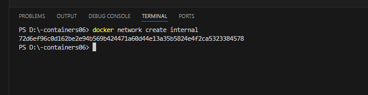

# Лабораторная работа №6: Управление взаимодействием нескольких контейнеров

**Выполнила:** Годорожа Оксана, группа I2302  
**Дата:** 05 апреля 2025 г.

## Цель работы
Научиться управлять взаимодействием нескольких контейнеров в Docker, создав PHP-приложение на базе контейнеров `nginx` и `php-fpm`.

## Задание
Разработать PHP-приложение, работающее с использованием двух контейнеров:
- `nginx` — для обработки HTTP-запросов;
- `php-fpm` — для выполнения PHP-кода.

## Выполнение работы:

### Подготовка

1. **Требования:**
  
   - Опыт выполнения лабораторной работы №3 (работа с PHP-сайтом).

2. **Создание репозитория:**
   - Создала репозиторий `containers06` на GitHub.
   
   - Склонируйте его на локальный компьютер:
   ```bash
    git clone https://github.com/GodorojaOxana2004/-containers06.git
   ```
    

## Создаем структуру проекта:

- Создала директорию для сайта


- Создала файл .gitignore в корне проекта и добавила в него строки:

```bash
# Ignore files and directories
mounts/site/*
```


- Создала в директории containers06 файл nginx/default.conf со следующим содержимым:

```bash
server {
    listen 80;
    server_name _;
    root /var/www/html;
    index index.php;
    location / {
        try_files $uri $uri/ /index.php?$args;
    }
    location ~ \.php$ {
        fastcgi_pass backend:9000;
        fastcgi_index index.php;
        fastcgi_param SCRIPT_FILENAME $document_root$fastcgi_script_name;
        include fastcgi_params;
    }
}
```


## Запуск и тестирование:

### Создание сети и контейнеров

- Создайте сеть internal:

```bash
docker network create internal
```



`docker network create internal` создаёт пользовательскую сеть. Здесь сеть называется internal, она изолирует контейнеры и позволяет им взаимодействовать по именам.

- Запуск контейнера backend:

1. На базе образа `php:7.4-fpm`;
2. К контейнеру примонтирована директория `mounts/site` в `/var/www/html`;
3. Работает в сети `internal`.

```bash
docker run -d --name backend --network internal -v "D:\-containers06\mounts\site:/var/www/html" php:7.4-fpm
```

- **`docker run`** — запускает новый контейнер.
- **`-d`** — запускает контейнер в фоновом режиме.
- **`--name backend`** — дает контейнеру имя **backend**.
- **`--network internal`** — подключает контейнер к сети **internal**.
- **`-v "D:\-containers06\mounts\site:/var/www/html"`** — монтирует локальную папку с сайтом в контейнер по пути **/var/www/html**.
- **`php:7.4-fpm`** — использует образ **PHP 7.4 с FPM** для запуска контейнера.
 FPM (FastCGI Process Manager) — это улучшенная версия PHP, предназначенная для работы с веб-серверами, такими как Nginx или Apache, через протокол FastCGI.
FastCGI — это протокол для взаимодействия веб-сервера (например, Nginx или Apache) с веб-приложениями, такими как PHP, Python, Ruby и другие.


Путь на скрине неправильнный, я исправляла путь уже в процессе создания лабораторной работы чуть позже.


- Запуск контейнера `frontend`:

1. На базе образа `nginx:1.23-alpine`;
2. С примонтированной директорией `mounts/site` в `/var/www/html`;
3. С примонтированным файлом `nginx/default.conf` в `/etc/nginx/conf.d/default.conf`;
4. Порт 80 контейнера проброшен на порт 80 хоста;
5. Работает в сети `internal`.

```bash
docker run -d --name frontend --network internal -v "D:\-containers06\mounts\site:/var/www/html" -v "D:\-containers06\nginx\default.conf:/etc/nginx/conf.d/default.conf" -p 80:80 nginx:1.23-alpine
```

- **`docker run`** — запускает новый контейнер.
- **`-d`** — запускает контейнер в фоновом режиме.
- **`--name frontend`** — дает контейнеру имя **frontend**.
- **`--network internal`** — подключает контейнер к сети **internal**.
- **`-v "D:\-containers06\mounts\site:/var/www/html"`** — монтирует локальную папку с сайтом в контейнер по пути **/var/www/html**.
- **`-v "D:\-containers06\nginx\default.conf:/etc/nginx/conf.d/default.conf"`** — монтирует конфигурационный файл Nginx с хоста в контейнер на путь **/etc/nginx/conf.d/default.conf**.
- **`-p 80:80`** — пробрасывает порт 80 контейнера на порт 80 хоста, чтобы сайт был доступен через **http://localhost**.
- **`nginx:1.23-alpine`** — использует образ Nginx версии **1.23** на основе **Alpine Linux** для запуска контейнера.


После проверяем созданные контейнеры:


После перехожу на сайт по порту которому мы указали:


## Все работает!


# Ответы на вопросы
- Каким образом в данном примере контейнеры могут взаимодействовать друг с другом?
Через сеть internal по протоколу FastCGI. Nginx (frontend) передаёт PHP-запросы на backend:9000, где backend — контейнер с PHP-FPM.

- Как видят контейнеры друг друга в рамках сети internal?
По именам в одной сети. Docker настраивает DNS, поэтому backend доступен по имени backend.

- Почему необходимо было переопределять конфигурацию Nginx?
По умолчанию Nginx не обрабатывает PHP. Мы добавили правила для передачи PHP-запросов в PHP-FPM (backend:9000).

## Выводы
- В ходе выполнения лабораторной работы я создала PHP-приложение, используя два контейнера: `nginx` и `php-fpm`. Это позволило разделить задачи обработки HTTP-запросов и выполнения PHP-кода.
- Настроила сеть `internal`, благодаря чему контейнеры смогли взаимодействовать между собой. Это упростило их связь без необходимости указывать IP-адреса вручную.
- Выполнила монтирование файлов сайта и конфигурации Nginx в контейнеры с помощью команды `docker run -v`, что обеспечило доступ к нужным данным внутри контейнеров.
- Проверила работу сайта через браузер по адресу `http://localhost`, убедившись, что PHP-страницы отображаются корректно после настройки взаимодействия через FastCGI.
- Получила практические навыки работы с Docker: создание сетей командой `docker network create`, запуск контейнеров с нужными параметрами и настройка веб-сервера для поддержки PHP.
- Осознала важность правильной конфигурации Nginx для работы с PHP, так как без неё сайт не смог бы обрабатывать динамические страницы.

## Библиография:

- Докер-сети (docs.docker.com/network)

- Образ PHP-FPM (hub.docker.com/_/php)

- Образ Nginx (hub.docker.com/_/nginx)

- Лабораторная работа 3 (https://moodle.usm.md/mod/assign/view.php?id=282116)